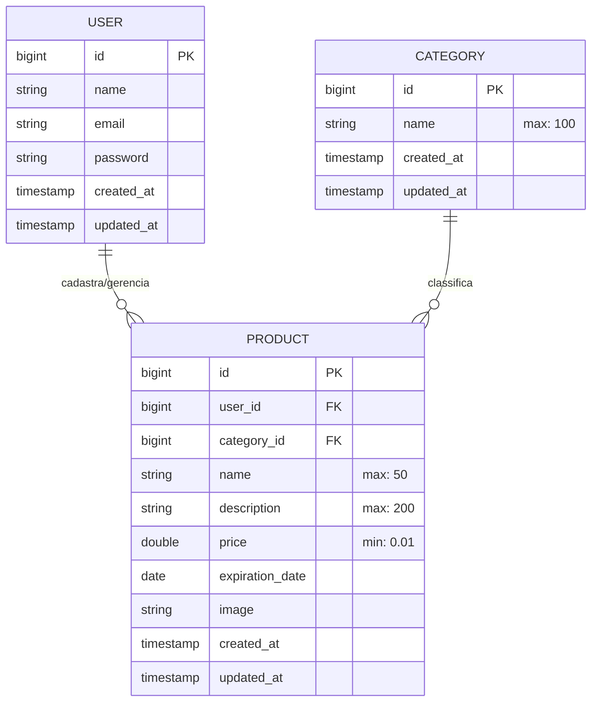
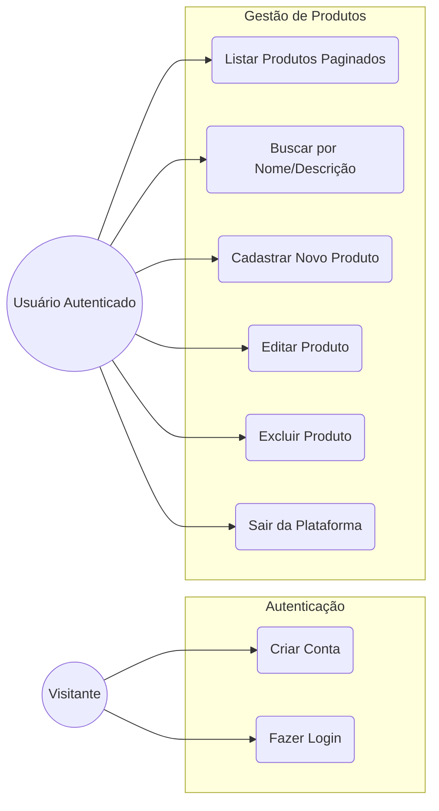
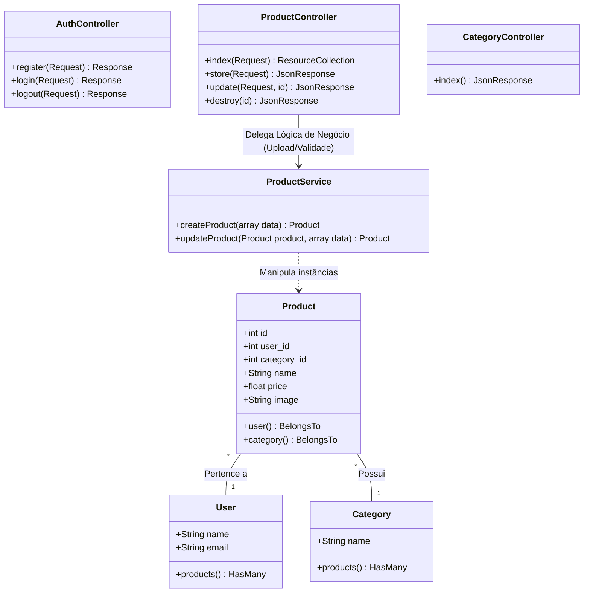

# Sistema de Gestão de Produtos - Fullstack

## Visão Geral

Este projeto é uma **API RESTful** desenvolvida com **Laravel 11**, **MySQL 8.4** e **Docker (Sail)**, integrada a um frontend em **Vue 3**. 

A aplicação foi desenhada seguindo as melhores práticas do mercado, adotando o **Service Pattern** no backend para isolar a regra de negócio dos Controladores. No frontend, utiliza **TypeScript** para garantir a segurança dos tipos, autenticação por token (Sanctum), gerenciamento de estado global com **Pinia**, e uma interface responsiva com **PrimeVue** e **Tailwind CSS**.

---

## Tecnologias e Ferramentas

### Backend
* **PHP 8.5 & Laravel 13:** Frameworks robustos escolhidos pela sua velocidade de desenvolvimento, segurança embutida e ORM poderoso (Eloquent).
* **MySQL 8.4:** Banco de dados padrão da indústria.
* **Laravel Sail (Docker):** Utilizado para padronizar o ambiente de desenvolvimento, permitindo que o projeto rode apenas com o comando `docker compose up -d` sem a necessidade de instalar PHP ou MySQL localmente na máquina do desenvolvedor.
* **Laravel Sanctum:** Escolhido para fornecer um sistema leve e seguro de autenticação baseada em tokens (SPA/API).

### Frontend
* **VueJS 3:** Utilizado Coforme Exigido.
* **TypeScript:** Utilizado Coforme Exigido.
* **Pinia:** A biblioteca moderna de gestão de estado do Vue, utilizada para manter a persistência do usuário logado e os tokens de autenticação.
* **Tailwind CSS:** Utilizado para criar um design responsivo e customizado de forma ágil, diretamente no código.
* **PrimeVue:** Biblioteca de componentes de UI escolhida para acelerar a construção de interfaces complexas e interativas, como DataTables (com paginação embutida), modais, dropdowns e alertas visuais (Toasts/Confirms).
* **Axios:** Cliente HTTP utilizado pela sua simplicidade na interceção de requisições e injeção automática do Bearer Token.

---

## Estrutura do Projeto

```text
/
├── app/
│   ├── Http/Controllers/  # Controllers da API v1 (Auth, Product, Category)
│   ├── Services/          # Service Pattern (ProductService, AuthService - Lógica de Negócio)
│   └── Models/            # Entidades e Relacionamentos (Product, Category, User)
├── database/
│   ├── migrations/        # Estrutura do banco de dados e regras de campos nulos
│   └── seeders/           # Dados de teste iniciais (Usuário Admin e 9 Categorias)
├── routes/
│   └── api.php            # Definição dos endpoints da API RESTful protegidos
├── compose.yaml           # Configuração de infraestrutura Docker (Laravel Sail)
│
└── frontend/
    ├── src/
    │   ├── services/      # Configuração do Axios e Interceptors
    │   ├── stores/        # Gerenciamento de Estado (Pinia)
    │   ├── router/        # Rotas do Vue Router (Guards de Autenticação)
    │   └── views/         # Interfaces principais (RegisterView, LoginView e DashboardView)
    └── package.json       # Dependências NPM
```

---

## Como Executar o Projeto

### Pré-requisitos:

- Docker Desktop em execução  
- WSL2 habilitado (para usuários de Windows)  

**Aviso:** Recomenda-se utilizar o terminal do Ubuntu (WSL).

---

### Passo 1: Clonar e Configurar o Ambiente

```bash
git clone https://github.com/samuelsouzato/innyx-desafio-produtos.git
cd innyx-desafio-produtos

cp .env.example .env
```

---

### Passo 2: Instalar Dependências do PHP via Docker

```bash
docker run --rm \
    -u "$(id -u):$(id -g)" \
    -v "$(pwd):/var/www/html" \
    -w /var/www/html \
    laravelsail/php83-composer:latest \
    composer install --ignore-platform-reqs
```

---

### Passo 3: Subir os Containers

```bash
./vendor/bin/sail up -d
```

---

### Passo 4: Preparar Banco e Storage

```bash
./vendor/bin/sail artisan key:generate
./vendor/bin/sail artisan migrate:refresh --seed
./vendor/bin/sail artisan storage:link
```

---

### Passo 5: Rodar o Frontend

```bash
./vendor/bin/sail npm --prefix frontend install
./vendor/bin/sail npm --prefix frontend run dev
```

---

### Passo 6: Acessar a Aplicação

- **URL:** http://localhost  
- **Usuário:** admin@innyx.com  
- **Senha:** admin1234  

---

## Funcionalidades e Diferenciais Implementados

- **Service Pattern:**  
  Lógica isolada no `ProductService`.

- **UX Inteligente:**  
  Categoria "Alimentos" exige validade automaticamente.

- **Busca + Paginação Server-Side:**  
  Backend com filtro por nome/descrição + debounce no frontend.

- **Upload de Imagens:**  
  Nome único + remoção automática ao deletar/substituir.

- **Isolamento de Dados:**  
  Cada usuário acessa apenas seus próprios produtos.

---

## Arquitetura e Modelagem

### 1. Modelo Entidade-Relacionamento (MER)



### 2. Diagrama de Casos de Uso



### 3. Diagrama de Classes (Backend)



---

## Comandos Auxiliares

```bash
./vendor/bin/sail stop

cd innyx-desafio-produtos
./vendor/bin/sail up -d
./vendor/bin/sail npm --prefix frontend run dev
```

---

## Adminer (Banco de Dados)

- **URL:** http://localhost:8080  
- **Servidor:** mysql  
- **Usuário:** sail  
- **Senha:** password  

---

## 📡 Rotas do Sistema (Endpoints API v1)

A API utiliza o prefixo `/api/v1/` e todas as rotas de gestão exigem o cabeçalho:

```
Authorization: Bearer {token}
```

---

### Autenticação (Públicas)

| Método | Endpoint   | Descrição                                      |
|--------|------------|-----------------------------------------------|
| POST   | /register  | Cria um novo usuário no sistema               |
| POST   | /login     | Valida credenciais e retorna o token de acesso |

---

### Gestão e Recursos (Protegidas)

| Método | Endpoint           | Descrição                                                     |
|--------|--------------------|---------------------------------------------------------------|
| GET    | /me                | Retorna os dados do usuário logado                           |
| POST   | /logout            | Invalida o token atual e encerra a sessão                    |
| GET    | /categories        | Lista todas as categorias para preenchimento do formulário   |
| GET    | /products          | Lista produtos do usuário com paginação e busca              |
| POST   | /products          | Faz upload da imagem e cadastra um novo produto              |
| PUT    | /products/{id}     | Atualiza dados ou imagem de um produto existente             |
| DELETE | /products/{id}     | Remove o produto e apaga o ficheiro de imagem do servidor    |